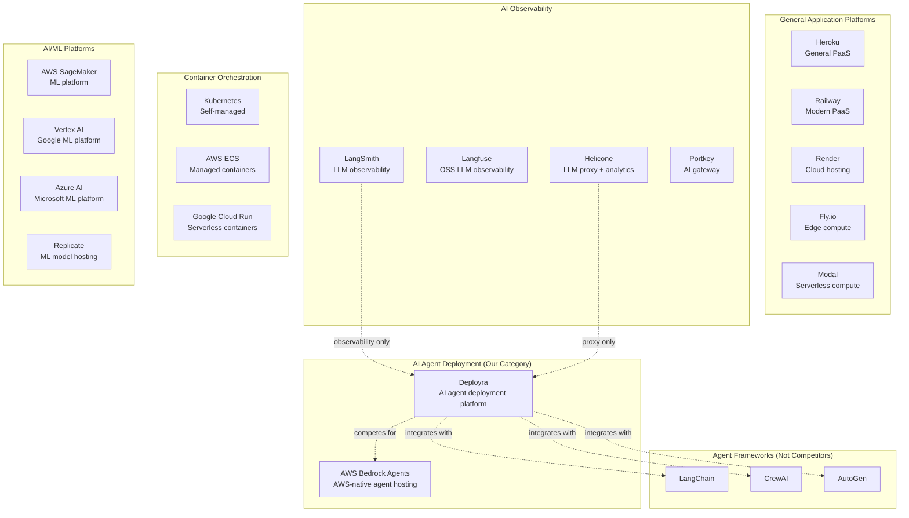

# Deployra — Competitive Landscape Analysis

> Version 1.0 | March 2026 | Strategic Intelligence

## Table of Contents

1. [Market Map](#market-map)
2. [Detailed Competitor Analysis](#detailed-competitor-analysis)
3. [Differentiation Matrix](#differentiation-matrix)
4. [Moat Analysis](#moat-analysis)
5. [Risk Analysis](#risk-analysis)
6. [Counter-Positioning Strategy](#counter-positioning-strategy)

---

## Market Map

**Deployra's unique position:** We sit at the intersection of AI agent deployment, LLM cost management, and container orchestration. No single competitor covers all three.

---

## Detailed Competitor Analysis

### 1. AWS Bedrock Agents

**What they do:** AWS-native service for building and deploying AI agents. Part of the broader Bedrock suite for foundation model access.

| Attribute | Details |
|-----------|---------|
| **Funding** | Amazon ($1.9T market cap) |
| **Pricing** | Pay-per-use: $0.001/step for agent invocation + model costs |
| **Strengths** | AWS ecosystem integration, enterprise trust, multi-model access, managed infrastructure |
| **Weaknesses** | Rigid agent definition (action groups, not arbitrary code), only supports Bedrock-hosted models, poor developer experience, complex configuration (CloudFormation/CDK), no real-time cost tracking per agent, vendor lock-in |

**Why we win:** Bedrock Agents forces you into AWS's agent paradigm. You can't deploy a LangChain agent or a CrewAI team on Bedrock — you have to rewrite everything using their SDK. Deployra deploys any framework, any code, with one command. Our LLM proxy works with any provider (OpenAI, Anthropic, Google), not just AWS-hosted models.

---

### 2. LangSmith (by LangChain)

**What they do:** Observability and evaluation platform for LLM applications. Tracing, debugging, testing, and monitoring.

| Attribute | Details |
|-----------|---------|
| **Funding** | $25M Series A (Sequoia), $70M total |
| **Pricing** | Free tier (5K traces), Plus ($39/seat/mo), Enterprise (custom) |
| **Strengths** | Deep LangChain integration, best-in-class tracing, strong brand in AI developer community, evaluation tools, prompt playground |
| **Weaknesses** | Observability only — does not deploy agents. No container management, no auto-scaling, no budget enforcement, no model fallback. Requires self-managed infrastructure for production. LangChain-centric (limited value for CrewAI/AutoGen). |

**Why we win:** LangSmith tells you what happened. Deployra runs the agent AND tells you what happened. They're complementary — a developer might use LangSmith for detailed tracing and Deployra for deployment, costs, and budget controls. We have lighter observability built in (sufficient for most users), plus the entire deployment and runtime layer that LangSmith doesn't touch.

---

### 3. Langfuse

**What they do:** Open-source LLM observability platform. Self-hostable alternative to LangSmith.

| Attribute | Details |
|-----------|---------|
| **Funding** | $4M Seed (Y Combinator W23) |
| **Pricing** | Open source (self-host free), Cloud: Hobby (free), Pro ($59/mo), Team ($399/mo) |
| **Strengths** | Open source (trust, customization), framework-agnostic, good tracing UI, growing community (10K+ GitHub stars), self-hostable for compliance |
| **Weaknesses** | Observability only — same gap as LangSmith. No deployment, no runtime, no cost enforcement. Smaller ecosystem than LangSmith. |

**Why we win:** Same positioning as vs. LangSmith — they observe, we deploy + observe. Langfuse is a potential integration partner, not a competitor. We could offer Langfuse integration for customers who want deeper tracing beyond our built-in telemetry.

---

### 4. Helicone

**What they do:** LLM proxy and analytics platform. Routes LLM calls through their proxy for logging, caching, and rate limiting.

| Attribute | Details |
|-----------|---------|
| **Funding** | $7M Seed |
| **Pricing** | Free (100K requests/mo), Growth ($60/mo), Enterprise (custom) |
| **Strengths** | Simple integration (change base URL), good analytics dashboard, request-level logging, caching, prompt management |
| **Weaknesses** | Proxy only — no deployment, no container management, no agent lifecycle. No budget enforcement (tracking only). No framework detection or auto-scaling. Limited to LLM call analytics. |

**Why we win:** Helicone is essentially our LLM proxy extracted as a standalone product. We have the proxy AND the entire deployment platform. Our proxy also does budget enforcement (not just tracking), model fallback, and is integrated with the agent lifecycle (pause agent when budget exceeded). Helicone requires you to manage your own deployment.

---

### 5. Portkey

**What they do:** AI gateway providing routing, fallback, caching, and observability for LLM calls.

| Attribute | Details |
|-----------|---------|
| **Funding** | $3M Seed |
| **Pricing** | Free (10K requests/day), Production ($49/mo), Enterprise (custom) |
| **Strengths** | Multi-provider routing, fallback chains, caching, load balancing, good SDK support, virtual keys for API key management |
| **Weaknesses** | Gateway only — same as Helicone. No deployment platform, no container orchestration, no agent lifecycle management, no dashboard for agent-level metrics. |

**Why we win:** Portkey is another proxy-only solution. Strong in routing and fallback, but doesn't deploy or manage agents. Our LLM proxy has similar routing capabilities, but they're integrated into a complete platform. A developer using Portkey still needs to set up ECS, Docker, monitoring, and scaling themselves.

---

### 6. Heroku

**What they do:** General-purpose Platform-as-a-Service. `git push heroku main` deploys any web application.

| Attribute | Details |
|-----------|---------|
| **Funding** | Acquired by Salesforce ($26B in 2020) |
| **Pricing** | Basic ($7/mo dynos), Standard ($25/mo), Performance ($250/mo) |
| **Strengths** | Legendary developer experience, `git push` deploy model, add-on ecosystem, 15+ year track record, strong brand recognition |
| **Weaknesses** | Not AI-aware at all — no LLM cost tracking, no token counting, no budget controls, no model fallback. No framework detection for AI agents. Expensive for compute-intensive workloads. No real-time agent monitoring. Salesforce ownership has slowed innovation. |

**Why we win:** Heroku is our spiritual predecessor — we're building the Heroku experience for the AI agent era. But Heroku doesn't know what an LLM is. It can't track costs per model, enforce budgets, or switch providers on failure. Deploying an AI agent on Heroku gives you a running container with zero AI-specific tooling.

---

### 7. Railway

**What they do:** Modern PaaS for deploying web applications. GitHub integration, instant deploys, usage-based pricing.

| Attribute | Details |
|-----------|---------|
| **Funding** | $51M total (Series A + B) |
| **Pricing** | Usage-based: $5/mo + $0.000231/vCPU-minute + $0.000231/GB-minute |
| **Strengths** | Beautiful UI, instant deploys, great DX, usage-based pricing, growing fast, active community, supports Docker natively |
| **Weaknesses** | General-purpose — no AI-specific features. No LLM cost tracking, no budget controls, no model fallback, no agent-specific monitoring. No framework detection. |

**Why we win:** Railway is excellent for web apps but doesn't understand AI agents. A developer deploying on Railway gets a running container — same as Heroku. They'd still need to build LLM cost tracking, budget enforcement, and monitoring themselves. We provide all of that out of the box.

---

### 8. Render

**What they do:** Cloud hosting platform for web applications, static sites, and background workers.

| Attribute | Details |
|-----------|---------|
| **Funding** | $90M total (Series B) |
| **Pricing** | Free tier, Individual ($7/mo instances), Team ($19/mo/user), Organization (custom) |
| **Strengths** | Simple pricing, good DX, auto-deploy from GitHub, managed PostgreSQL, Redis, auto-scaling |
| **Weaknesses** | General-purpose — identical gap as Heroku and Railway. No AI agent awareness. |

**Why we win:** Same story as Heroku and Railway. Render is a great general PaaS, but AI agents need specialized tooling that general platforms don't provide.

---

### 9. Modal

**What they do:** Serverless compute platform focused on data/ML workloads. Run Python functions in the cloud with GPU support.

| Attribute | Details |
|-----------|---------|
| **Funding** | $64M total (Series B) |
| **Pricing** | Pay-per-second compute: $0.000056/s (CPU), $0.34/hr (A10G GPU) |
| **Strengths** | Incredible DX for Python developers, GPU support, serverless (scale to zero), fast cold starts, good for ML batch jobs, growing rapidly |
| **Weaknesses** | Function-oriented (not long-running agent-oriented). No LLM cost tracking built in. No budget enforcement. No agent lifecycle management (health checks, auto-restart). No dashboard for agent-specific metrics. Python-only. |

**Why we win:** Modal is great for running GPU-heavy Python functions. But AI agents are long-running services, not functions. An agent needs persistent health checks, budget controls that operate over time, and a dashboard showing ongoing costs. Modal's serverless model works well for batch ML, less well for always-on agents.

---

### 10. Custom Kubernetes

**What they do:** Self-managed container orchestration using Kubernetes (EKS, GKE, or self-hosted).

| Attribute | Details |
|-----------|---------|
| **Funding** | N/A (open source + cloud provider managed services) |
| **Pricing** | EKS: $0.10/hr cluster + node costs. GKE: $0.10/hr + node costs. |
| **Strengths** | Maximum flexibility, any workload, any scale, portable across clouds, massive ecosystem, battle-tested at scale |
| **Weaknesses** | Enormous operational overhead (4-8 weeks initial setup, 10-20 hrs/week maintenance). Requires dedicated DevOps expertise. No AI-specific features. No LLM cost tracking. No budget controls. Over-engineered for most AI agent workloads. |

**Why we win:** Kubernetes is the "build everything yourself" option. It's the most powerful and the most painful. For a team of 3-20 AI engineers, Kubernetes is overkill. They don't need a general-purpose orchestrator — they need an AI agent platform. We abstract all the K8s complexity into one command.

---

### 11. Replicate

**What they do:** Platform for running ML models via API. Host custom models or use community models.

| Attribute | Details |
|-----------|---------|
| **Funding** | $60M total (Series B) |
| **Pricing** | Pay-per-second for model inference. Varies by model/hardware. |
| **Strengths** | Easy model deployment, GPU support, large model library, good API, fast cold starts with Cog packaging |
| **Weaknesses** | Model hosting, not agent hosting. Designed for inference endpoints, not multi-step agent workflows. No agent lifecycle management, no budget controls, no multi-framework support. |

**Why we win:** Replicate hosts models. We host agents that call models. Different abstraction layer. An agent on Deployra might call a model on Replicate, or call OpenAI directly. We orchestrate the agent, they serve the model.

---

## Differentiation Matrix

| Feature | Deployra | Bedrock Agents | LangSmith | Helicone | Portkey | Heroku | Railway | Modal | K8s |
|---------|:--------:|:--------------:|:---------:|:--------:|:-------:|:------:|:-------:|:-----:|:---:|
| One-command deploy | ✅ | ❌ | ❌ | ❌ | ❌ | ✅ | ✅ | ✅ | ❌ |
| Framework auto-detect | ✅ | ❌ | ❌ | ❌ | ❌ | ❌ | ❌ | ❌ | ❌ |
| LLM cost tracking | ✅ | ⚠️ | ✅ | ✅ | ✅ | ❌ | ❌ | ❌ | ❌ |
| Budget enforcement | ✅ | ❌ | ❌ | ❌ | ❌ | ❌ | ❌ | ❌ | ❌ |
| Model fallback | ✅ | ❌ | ❌ | ✅ | ✅ | ❌ | ❌ | ❌ | ❌ |
| Agent health checks | ✅ | ✅ | ❌ | ❌ | ❌ | ✅ | ✅ | ❌ | ✅ |
| Auto-restart | ✅ | ✅ | ❌ | ❌ | ❌ | ✅ | ✅ | ❌ | ✅ |
| Live log streaming | ✅ | ⚠️ | ✅ | ⚠️ | ❌ | ✅ | ✅ | ✅ | ✅ |
| Agent dashboard | ✅ | ⚠️ | ✅ | ✅ | ✅ | ❌ | ⚠️ | ⚠️ | ❌ |
| Multi-framework | ✅ | ❌ | ⚠️ | ✅ | ✅ | ✅ | ✅ | ⚠️ | ✅ |
| Zero-downtime deploy | ✅ | ✅ | N/A | N/A | N/A | ✅ | ✅ | N/A | ✅ |
| Response caching | ✅ | ❌ | ❌ | ✅ | ✅ | ❌ | ❌ | ❌ | ❌ |
| Auto-scaling | ✅ | ✅ | N/A | N/A | N/A | ✅ | ✅ | ✅ | ✅ |
| Team/RBAC | ✅ | ✅ | ✅ | ✅ | ✅ | ⚠️ | ✅ | ✅ | ✅ |

✅ = Full support | ⚠️ = Partial/limited | ❌ = Not supported

**Key insight:** No single competitor covers all columns. Deployra is the only platform that combines deployment, LLM economics, and agent-specific operations in one product.

---

## Moat Analysis

### 1. Technical Complexity Moat

**Strength: Medium-High**

The LLM proxy with cross-provider format translation, real-time token counting, budget enforcement, and intelligent caching is ~4 months of dedicated engineering. The telemetry pipeline (Kafka → ClickHouse with materialized views) adds another 2 months. Building the complete platform from scratch would take a well-funded team 6-9 months.

**Durability:** Medium. Technical moats erode over time as competitors invest. However, we'll be iterating and adding features faster than anyone can copy.

### 2. Data & Learning Moat

**Strength: High (growing over time)**

Every LLM call through our proxy generates data: token usage patterns, cost trends, failure rates per provider, response latencies, cache hit rates. Over time, this data enables:
- Smarter caching (predict which prompts will be repeated)
- Better routing (know which provider is cheapest/fastest for specific workloads)
- Cost optimization recommendations ("Switch this agent to GPT-4o-mini and save 85%")
- Anomaly detection ("This agent's token usage spiked 300% — likely a bug")

**Durability:** High. Data moats compound. Every new customer makes the platform smarter for all customers.

### 3. Switching Cost Moat

**Strength: Medium (growing with usage)**

Switching costs increase with:
- Number of agents deployed (each needs re-deployment)
- CI/CD integration (pipelines reference `deployra deploy`)
- Dashboard reliance (team workflows built around Deployra metrics)
- Budget configuration (limits set per agent/team)
- URL dependencies (external systems hit `*.deployra.run` endpoints)
- Secret storage (API keys stored in Deployra, need re-provisioning)

At 10+ agents, switching takes 2-4 days. At 50+ agents, it's a multi-week project.

### 4. Ecosystem & Community Moat

**Strength: Low (building)**

Plans to strengthen:
- Official integration in LangChain, CrewAI, AutoGen docs
- Template marketplace (community-contributed agent templates)
- Plugin ecosystem (monitoring integrations, CI/CD plugins)
- Developer advocacy program
- Open-source CLI and examples (GitHub stars, contributors)

### 5. Brand & Trust Moat

**Strength: Low (building)**

Plans to strengthen:
- SOC 2 certification
- Public uptime page
- Security whitepaper
- Customer testimonials and case studies
- Conference presence and thought leadership

---

## Risk Analysis

### Risk 1: AWS Builds a Better Version

**Probability:** Medium (30%)
**Impact:** High
**Timeline:** 12-18 months

**Scenario:** AWS launches "Amazon Agent Platform" — a managed service for deploying any AI agent with cost tracking and controls.

**Why it's unlikely at full strength:**
- AWS has historically been bad at developer experience (CloudFormation, SAM)
- AWS optimizes for enterprise procurement, not individual developer adoption
- AWS won't support non-AWS models (OpenAI, Anthropic) in their platform
- AWS is slow to ship new products (Bedrock Agents took 2 years from concept to GA)

**Mitigation:**
1. Move fast — establish brand and user base before AWS can ship
2. Multi-cloud support (GCP, Azure) makes us valuable even to AWS customers
3. Superior DX is defensible — AWS can't match a startup's iteration speed
4. If AWS builds basic version, position Deployra as the "premium developer experience" layer

### Risk 2: LangChain Builds Deployment Features into LangSmith

**Probability:** Medium (35%)
**Impact:** High
**Timeline:** 6-12 months

**Scenario:** LangChain adds deployment features to LangSmith — "LangSmith Deploy" button that deploys to their infrastructure.

**Why it's unlikely at full strength:**
- Deployment infrastructure is a completely different technical challenge from observability
- LangChain is framework-locked; they won't support CrewAI/AutoGen
- Running container infrastructure at scale requires deep ops expertise LangChain doesn't have
- LangChain's business model is observability revenue, not compute revenue

**Mitigation:**
1. Be framework-agnostic (our strength vs. LangChain's lock-in)
2. Build strategic relationship with LangChain (angel investment, partnership)
3. If they build basic deploy, emphasize our superior cost controls, multi-model fallback, and multi-framework support
4. Make Deployra the "deploy from LangSmith" integration

### Risk 3: General PaaS Adds AI Features

**Probability:** Medium (40%)
**Impact:** Medium
**Timeline:** 6-18 months

**Scenario:** Railway, Render, or Heroku adds "AI Agent Mode" with LLM cost tracking.

**Why the impact is limited:**
- Bolt-on AI features won't match purpose-built depth (budget enforcement, format translation, fallback chains)
- General PaaS can't auto-detect frameworks or generate AI-optimized Dockerfiles
- Their pricing model optimizes for general compute, not AI agent economics
- They'd need to build the entire LLM proxy from scratch

**Mitigation:**
1. Stay 12+ months ahead in feature depth
2. Build integrations that make Deployra + Railway/Render complementary
3. Position depth vs. breadth: "They added a cost dashboard; we have budget enforcement, fallback chains, and caching"

### Risk 4: Open Source Alternative Emerges

**Probability:** Medium-High (45%)
**Impact:** Medium
**Timeline:** 6-12 months

**Scenario:** An open-source "Deployra clone" appears on GitHub and gains traction.

**Mitigation:**
1. Open-source our CLI and examples (control the narrative)
2. Managed platform value proposition: "You could run it yourself, or we handle everything for $29/mo"
3. Move fast on features that are hard to replicate in OSS (multi-cloud, enterprise features, managed infrastructure)
4. Same playbook as Supabase vs. raw PostgreSQL, or Vercel vs. raw Next.js

### Risk 5: LLM Market Consolidation

**Probability:** Low (15%)
**Impact:** Medium
**Timeline:** 24+ months

**Scenario:** Market consolidates to 1-2 LLM providers, reducing value of multi-model routing and fallback.

**Mitigation:**
1. Multi-model support is one feature, not the only feature
2. Even with 1 provider, cost tracking, budget controls, and deployment are still valuable
3. History suggests markets diversify, not consolidate (AWS didn't kill GCP or Azure)

---

## Counter-Positioning Strategy

### Against AWS Bedrock Agents
**Message:** "Deploy any agent, any framework, any model — not just what AWS supports."
**Proof point:** Show deploying a LangChain agent that uses OpenAI + Anthropic fallback. Impossible on Bedrock.

### Against LangSmith
**Message:** "Don't just observe your agents. Deploy, monitor, and control them."
**Proof point:** Side-by-side: LangSmith shows traces of a failed agent. Deployra would have auto-restarted it and switched to a backup model.

### Against Helicone/Portkey
**Message:** "An LLM proxy without a deployment platform is half a solution."
**Proof point:** Customer still needs to set up Docker, ECS, monitoring, DNS, SSL. Deployra does all of that plus the proxy.

### Against Heroku/Railway/Render
**Message:** "General platforms don't speak AI. Your agents deserve purpose-built infrastructure."
**Proof point:** Deploy same agent on Railway vs Deployra. Show the difference in cost visibility, budget controls, and monitoring.

### Against Custom Kubernetes
**Message:** "Your AI engineers should build agents, not manage Kubernetes clusters."
**Proof point:** Compare: 4 weeks to set up K8s + monitoring + cost tracking vs. 5 minutes on Deployra.

### Against "Build It Yourself"
**Message:** "Every hour you spend on deployment infrastructure is an hour not spent on your agent."
**Proof point:** Cost comparison: $50K/year in engineer time for DIY infrastructure vs. $5K/year for Deployra Team plan.

---

*This competitive analysis should be refreshed quarterly. Set a calendar reminder to review competitor product updates, funding announcements, and market shifts.*
