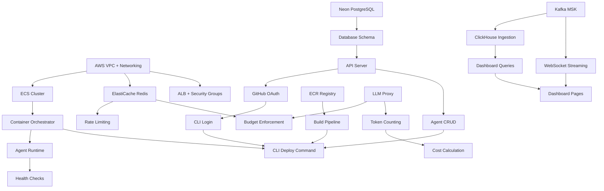

# Deployra — Master Execution Tracker

> Version 1.0 | March 2026 | Single Source of Truth

## Table of Contents

1. [Week 1-16 Milestone Tracker](#week-1-16-milestone-tracker)
2. [KPI Targets Per Phase](#kpi-targets-per-phase)
3. [Decision Log](#decision-log)
4. [Risk Register](#risk-register)
5. [Dependency Tracker](#dependency-tracker)
6. [Resource Allocation](#resource-allocation)
7. [Weekly Review Template](#weekly-review-template)
8. [Monthly Board Update Template](#monthly-board-update-template)

---

## Week 1-16 Milestone Tracker

### Phase 1: Foundation (Week 1-2)

| Week | Milestone | Status | Owner | Notes |
|------|-----------|--------|-------|-------|
| W1 | Go monorepo structure + CI pipeline | ⬜ Not Started | Founder | Blocks all backend work |
| W1 | AWS VPC + networking via Terraform | ⬜ Not Started | Founder | 3 AZs, public/private/isolated subnets |
| W1 | Neon PostgreSQL provisioned + schema | ⬜ Not Started | Founder | All 10 tables from architecture doc |
| W1 | ECR private registry created | ⬜ Not Started | Founder | With lifecycle policies |
| W2 | API server skeleton (Chi + health endpoint) | ⬜ Not Started | Founder | Deploy to staging ECS |
| W2 | GitHub OAuth login + JWT issuance | ⬜ Not Started | Founder | RS256, 24h expiry |
| W2 | Agent CRUD API endpoints | ⬜ Not Started | Founder | Create, list, get, update, delete |
| W2 | API key CRUD endpoints | ⬜ Not Started | Founder | SHA-256 hashing, scopes |
| W2 | Rate limiting middleware | ⬜ Not Started | Founder | Redis sliding window |
| W2 | Integration tests for auth + CRUD | ⬜ Not Started | Founder | 90%+ coverage on auth package |

**Phase 1 Exit Criteria:** Staging API live. OAuth working. Agent CRUD functional. CI/CD running.

---

### Phase 2: Core Runtime (Week 3-4)

| Week | Milestone | Status | Owner | Notes |
|------|-----------|--------|-------|-------|
| W3 | Container Orchestrator (create/update ECS tasks) | ⬜ Not Started | Founder | Core of the runtime engine |
| W3 | Agent lifecycle state machine | ⬜ Not Started | Founder | All transitions tracked in DB |
| W3 | Health check sidecar system | ⬜ Not Started | Founder | 30s interval, 3-failure restart |
| W3 | Auto-restart logic (max 5, backoff) | ⬜ Not Started | Founder | Exponential backoff |
| W4 | LLM Proxy (Go reverse proxy) | ⬜ Not Started | Founder | OpenAI + Anthropic + Google |
| W4 | Token counting + cost calculation | ⬜ Not Started | Founder | Extract from provider responses |
| W4 | Budget enforcement (Redis counters) | ⬜ Not Started | Founder | Daily + monthly limits, auto-pause |
| W4 | Retry logic + fallback chain | ⬜ Not Started | Founder | 3 retries, then fallback |
| W4 | Secrets management (AES-256-GCM) | ⬜ Not Started | Founder | Encrypt/store/inject API keys |
| W4 | E2E integration test | ⬜ Not Started | Founder | Deploy → LLM call → cost tracked |

**Phase 2 Exit Criteria:** Agent containers running. LLM proxy tracking costs. Budget enforcement working.

---

### Phase 3: CLI + Deploy (Week 5-6)

| Week | Milestone | Status | Owner | Notes |
|------|-----------|--------|-------|-------|
| W5 | CLI project setup (Commander.js + tsup + pkg) | ⬜ Not Started | Founder | Binary builds for mac/linux |
| W5 | `deployra login` (GitHub OAuth device flow) | ⬜ Not Started | Founder | Local HTTP server callback |
| W5 | `deployra init` (interactive setup) | ⬜ Not Started | Founder | Framework auto-detection |
| W5 | Framework auto-detection engine | ⬜ Not Started | Founder | LangChain, CrewAI, AutoGen |
| W5 | Dockerfile generator (per framework) | ⬜ Not Started | Founder | Multi-stage, optimized |
| W6 | `deployra deploy` (full flow) | ⬜ Not Started | Founder | Upload → build → deploy → URL |
| W6 | Server-side build pipeline (Kaniko) | ⬜ Not Started | Founder | S3 cache, 300s timeout |
| W6 | `deployra logs` (historical + streaming) | ⬜ Not Started | Founder | WebSocket live stream |
| W6 | `deployra status` + `deployra destroy` | ⬜ Not Started | Founder | Status metrics, force destroy |
| W6 | E2E: LangChain agent full deploy flow | ⬜ Not Started | Founder | Under 60s target |

**Phase 3 Exit Criteria:** CLI installable. `deployra deploy` works E2E in under 60 seconds.

---

### Phase 4: Dashboard + Telemetry (Week 7-8)

| Week | Milestone | Status | Owner | Notes |
|------|-----------|--------|-------|-------|
| W7 | React + Vite + Tailwind project setup | ⬜ Not Started | Founder | TypeScript strict mode |
| W7 | Auth flow (GitHub OAuth → JWT cookie) | ⬜ Not Started | Founder | Redirect to /agents |
| W7 | Agent List page | ⬜ Not Started | Founder | Status, costs, run count |
| W7 | Agent Detail page | ⬜ Not Started | Founder | Overview with metrics cards |
| W8 | Kafka (MSK Serverless) + ClickHouse setup | ⬜ Not Started | Founder | Topics, tables, materialized views |
| W8 | Kafka producers in API/Proxy/Runtime | ⬜ Not Started | Founder | All events to Kafka |
| W8 | Agent Logs page with live streaming | ⬜ Not Started | Founder | WebSocket + level filters |
| W8 | Agent Costs page with charts | ⬜ Not Started | Founder | Recharts, by model/day |
| W8 | Deploy dashboard to S3 + CloudFront | ⬜ Not Started | Founder | app.deployra.ai |

**Phase 4 Exit Criteria:** Dashboard live. Real-time logs and costs visible. Telemetry pipeline running.

---

### Phase 5: Auth + Multi-tenancy (Week 9-10)

| Week | Milestone | Status | Owner | Notes |
|------|-----------|--------|-------|-------|
| W9 | Team creation + management | ⬜ Not Started | Eng 1 | Create, invite, remove |
| W9 | Role-based access control | ⬜ Not Started | Eng 1 | Owner/admin/member/viewer |
| W9 | PostgreSQL RLS policies | ⬜ Not Started | Eng 1 | Team-scoped data isolation |
| W9 | Team settings page (dashboard) | ⬜ Not Started | Eng 2 | Members, roles |
| W10 | Stripe billing integration | ⬜ Not Started | Founder | Subscription + usage |
| W10 | Billing page (dashboard) | ⬜ Not Started | Eng 2 | Plan, usage, invoices |
| W10 | Plan-based quota enforcement | ⬜ Not Started | Eng 1 | Agent limits per plan |
| W10 | Onboarding flow | ⬜ Not Started | Eng 2 | New user experience |

**Phase 5 Exit Criteria:** Multi-team support. Stripe billing working. Quotas enforced.

---

### Phase 6: Polish + Beta (Week 11-12)

| Week | Milestone | Status | Owner | Notes |
|------|-----------|--------|-------|-------|
| W11 | Error handling audit | ⬜ Not Started | All | Every endpoint returns proper errors |
| W11 | Zero-downtime deployments | ⬜ Not Started | Eng 1 | Blue-green via ECS |
| W11 | Deployment rollback | ⬜ Not Started | Eng 1 | CLI + API |
| W11 | Security audit | ⬜ Not Started | All | Injection, auth bypass, leakage |
| W12 | Documentation site | ⬜ Not Started | Eng 2 | docs.deployra.ai |
| W12 | Example agents (3 frameworks) | ⬜ Not Started | Founder | LangChain, CrewAI, AutoGen |
| W12 | Performance tests (50 agents, 1K req/s) | ⬜ Not Started | Eng 1 | Load testing |
| W12 | Production environment setup | ⬜ Not Started | Founder | Separate cluster + DB |
| W12 | First 5 beta users onboarded | ⬜ Not Started | Founder | Feedback collected |

**Phase 6 Exit Criteria:** Production live. Docs shipped. 5 beta users successfully deployed.

---

### Post-MVP: Growth Phase (Week 13-16)

| Week | Milestone | Status | Owner | Notes |
|------|-----------|--------|-------|-------|
| W13 | Hacker News launch | ⬜ Not Started | Founder | Show HN post |
| W13 | 20+ beta users onboarded | ⬜ Not Started | All | Feedback loop |
| W14 | Product Hunt launch | ⬜ Not Started | Founder | Top 3 target |
| W14 | LLM response caching | ⬜ Not Started | Eng 1 | Redis, SHA-256 key |
| W15 | Webhook notifications | ⬜ Not Started | Eng 1 | Agent lifecycle events |
| W15 | Cron triggers | ⬜ Not Started | Eng 2 | Schedule agent runs |
| W16 | Auto-scaling (custom controller) | ⬜ Not Started | Eng 1 | CPU + queue depth metrics |
| W16 | 100+ weekly active agents | ⬜ Not Started | All | Growth milestone |

---

## KPI Targets Per Phase

| Phase | KPI | Target | Measurement |
|-------|-----|--------|-------------|
| **Phase 1** | API response time (P99) | < 200ms | CloudWatch |
| **Phase 1** | CI pipeline duration | < 5 minutes | GitHub Actions |
| **Phase 1** | Test coverage (auth + CRUD) | > 90% | Go coverage tool |
| **Phase 2** | Agent deploy time (cached) | < 45 seconds | E2E test |
| **Phase 2** | LLM proxy overhead | < 5ms per request | Proxy metrics |
| **Phase 2** | Cost calculation accuracy | 100% (vs provider) | Manual audit |
| **Phase 3** | CLI install → first deploy | < 5 minutes | User testing |
| **Phase 3** | Framework detection accuracy | > 95% | Test suite |
| **Phase 3** | Build cache hit rate | > 80% (subsequent builds) | Build metrics |
| **Phase 4** | Dashboard load time | < 2 seconds | Lighthouse |
| **Phase 4** | Log streaming latency | < 2 seconds | E2E measurement |
| **Phase 4** | Telemetry pipeline lag | < 5 seconds | Kafka consumer lag |
| **Phase 5** | Cross-team data isolation | 0 leakage | Security tests |
| **Phase 5** | Stripe webhook reliability | > 99.9% | Stripe dashboard |
| **Phase 6** | System uptime | > 99.9% | Uptime monitoring |
| **Phase 6** | Concurrent agents (stress test) | 50 agents stable | Load test |
| **Phase 6** | Beta user NPS | > 40 | Survey |

---

## Decision Log

*Record every significant technical or business decision. Review monthly.*

| Date | Decision | Context | Options Considered | Decision & Rationale | Owner |
|------|----------|---------|-------------------|---------------------|-------|
| 2026-03-10 | Go for backend language | Need performant, maintainable backend | Go, Rust, Node.js | Go: fast, good concurrency, strong HTTP stdlib, easier hiring than Rust | Founder |
| 2026-03-10 | ECS Fargate for agent runtime | Need container orchestration | ECS, EKS, Lambda, Fly.io | Fargate: serverless containers, no cluster management, good isolation, AWS-native | Founder |
| 2026-03-10 | ClickHouse for telemetry | Need fast analytics on event data | ClickHouse, TimescaleDB, InfluxDB | ClickHouse: best for analytical queries, columnar, excellent compression, managed cloud option | Founder |
| 2026-03-10 | Neon for PostgreSQL | Need managed Postgres | Neon, Supabase, RDS, PlanetScale | Neon: serverless scaling, branching for dev, good free tier, Postgres compatible | Founder |
| | | | | | |

### Template for New Decisions

```
Date: YYYY-MM-DD
Decision: [Title]
Context: [What problem are we solving?]
Options:
  1. [Option A] — Pros: ... Cons: ...
  2. [Option B] — Pros: ... Cons: ...
  3. [Option C] — Pros: ... Cons: ...
Decision: [Which option and why]
Consequences: [What does this mean for the project?]
Revisit: [When should we reconsider? Under what conditions?]
Owner: [Who made the call]
```

---

## Risk Register

| ID | Risk | Probability | Impact | Mitigation | Owner | Status |
|----|------|------------|--------|-----------|-------|--------|
| R1 | ECS Fargate cold start > 60s | Medium | High | Pre-warm capacity, optimize image size, measure from day 1 | Founder | Open |
| R2 | LLM proxy adds > 10ms latency | Low | High | Profile early, benchmark at 1K req/s, optimize HTTP client | Eng 1 | Open |
| R3 | ClickHouse query performance degrades at scale | Medium | Medium | Materialized views, partition pruning, query optimization | Eng 1 | Open |
| R4 | Kaniko builds timeout at 300s | Medium | Medium | Layer caching, slim base images, parallel dep install | Founder | Open |
| R5 | Large ML dependencies make images > 5GB | High | Medium | Multi-stage builds, .deployraignore, image size warnings | Eng 2 | Open |
| R6 | AWS account service limits hit | Medium | High | Request limit increases week 1 for ECS, ECR, MSK, VPC | Founder | Open |
| R7 | Neon serverless cold start > 1s | Low | Medium | Monitor P99 latency, consider provisioned compute | Founder | Open |
| R8 | Security breach (API key exposure) | Low | Critical | AES-256-GCM encryption, no plaintext logging, security audit | All | Open |
| R9 | AWS costs exceed budget | Medium | High | Cost alerts, reserved instances, regular cost review | Founder | Open |
| R10 | Competitor launches similar product | Medium | Medium | Move fast, differentiate on DX, build community moat | Founder | Open |
| R11 | Beta users find critical bugs | High | Medium | Budget 2 days/sprint for bug fixes, rapid response SLA | All | Open |
| R12 | Stripe integration breaks during billing | Low | High | Webhook idempotency, retry logic, manual fallback process | Founder | Open |

---

## Dependency Tracker



### Critical Path

```
AWS VPC → ECS Cluster → Container Orchestrator → LLM Proxy → CLI Deploy → E2E Test
```

**This is the sequence that must be done in order. Everything else can be parallelized.**

### External Dependencies

| Dependency | Provider | Risk Level | Fallback |
|------------|----------|-----------|----------|
| AWS ECS Fargate | AWS | Low | GCP Cloud Run (long-term) |
| Neon PostgreSQL | Neon | Medium | AWS RDS |
| ClickHouse Cloud | ClickHouse | Medium | Self-hosted ClickHouse on ECS |
| MSK Serverless | AWS | Low | Self-managed Kafka on ECS |
| GitHub OAuth | GitHub | Low | Add Google/email OAuth |
| Stripe | Stripe | Low | No realistic alternative |

---

## Resource Allocation

### Week 1-8 (Solo Founder)

| Activity | % of Time | Hours/Week |
|----------|-----------|------------|
| Coding (backend + infra) | 60% | 30h |
| Coding (CLI + frontend) | 20% | 10h |
| Testing + debugging | 10% | 5h |
| Planning + docs | 5% | 2.5h |
| Admin + fundraising prep | 5% | 2.5h |

### Week 9-16 (3-Person Team)

**Founder:**
| Activity | % of Time |
|----------|-----------|
| Architecture + code review | 30% |
| Coding (complex features) | 30% |
| Fundraising | 20% |
| Product + strategy | 10% |
| Growth + community | 10% |

**Engineer 1 (Backend/Infra):**
| Activity | % of Time |
|----------|-----------|
| Backend development | 70% |
| Infrastructure + DevOps | 20% |
| Code review | 10% |

**Engineer 2 (Full-Stack/DX):**
| Activity | % of Time |
|----------|-----------|
| Dashboard development | 40% |
| CLI development | 30% |
| Documentation + examples | 20% |
| Code review | 10% |

---

## Weekly Review Template

*Complete every Sunday evening. 30 minutes max.*

```markdown
# Week [N] Review — [Date]

## What shipped this week
- [ ] Item 1
- [ ] Item 2
- [ ] Item 3

## What didn't ship (and why)
- Item 1: [Reason]
- Item 2: [Reason]

## Key metrics
- Deploy time (P50): ___s
- Active agents: ___
- API uptime: ____%
- Open bugs: ___

## Blockers
- [Blocker 1]: [Owner] — [Plan to unblock]

## Learnings
- [What surprised you this week?]

## Next week priorities (max 5)
1. [Priority 1]
2. [Priority 2]
3. [Priority 3]
4. [Priority 4]
5. [Priority 5]

## Mood check (1-5)
Energy: ___/5
Confidence in timeline: ___/5
Product conviction: ___/5
```

---

## Monthly Board Update Template

*Send to investors on the 1st of each month. Investors love updates — even pre-revenue.*

```markdown
# Deployra Monthly Update — [Month Year]

## TL;DR
[2-3 sentence summary of the month]

## Key Metrics

| Metric | Last Month | This Month | Change |
|--------|-----------|------------|--------|
| Weekly Active Agents | ___ | ___ | +___% |
| Total Signups | ___ | ___ | +___ |
| Paying Customers | ___ | ___ | +___ |
| MRR | $___ | $___ | +___% |
| Burn Rate | $___ | $___ | |
| Runway | ___ months | ___ months | |

## Highlights
- 🟢 [Big win 1]
- 🟢 [Big win 2]
- 🟢 [Big win 3]

## Challenges
- 🟡 [Challenge 1 — and what we're doing about it]
- 🟡 [Challenge 2 — and what we're doing about it]

## Product Updates
- [Feature 1 shipped]
- [Feature 2 shipped]
- [Feature 3 in progress]

## Team
- [Hiring updates]
- [Team health]

## Asks
- [Specific ask 1 — e.g., intro to X company]
- [Specific ask 2 — e.g., advice on Y]

## What's Next (30-day priorities)
1. [Priority 1]
2. [Priority 2]
3. [Priority 3]

---
Sent with gratitude,
[Founder Name]
CEO, Deployra
```

### Update Distribution

- **Investors:** Every month, without fail. Even if there's bad news. Especially if there's bad news.
- **Advisors:** Every month (same email).
- **Team:** Weekly sync (internal version with more detail).
- **Community:** Monthly blog post (public version with product updates).

---

*This tracker is the heartbeat of Deployra's execution. Update it daily. Review it weekly. If it's not in this tracker, it doesn't exist.*
