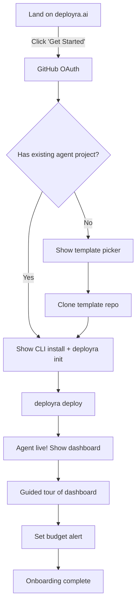

# Deployra — Product Specification

> Version 1.0 | March 2026 | Product & Strategy

## Table of Contents

1. [User Personas](#user-personas)
2. [User Journey Maps](#user-journey-maps)
3. [Feature Prioritization](#feature-prioritization)
4. [Detailed Feature Specs (P0)](#detailed-feature-specs-p0)
5. [Onboarding Flow](#onboarding-flow)
6. [Pricing](#pricing)
7. [Product Metrics](#product-metrics)
8. [Competitive Positioning](#competitive-positioning)
9. [Product Principles](#product-principles)

---

## User Personas

### Persona 1: Alex — The AI Startup Builder

**Demographics:**
- Age: 28, based in San Francisco
- Role: Co-founder & CTO at a 3-person AI startup
- Technical: Full-stack developer, 6 years experience, proficient in Python and LangChain
- Company: Building an AI-powered customer success platform

**Jobs to Be Done:**
1. Deploy 5 LangChain agents that handle customer queries, onboarding, and churn prediction.
2. Monitor LLM costs — burn rate is critical at pre-seed stage. Needs to stay under $500/month in LLM spend.
3. Ship fast — cannot spend 2 weeks setting up Kubernetes. Needs production deployment in hours, not weeks.
4. Demonstrate reliability to customers — agents must have 99.9% uptime with automatic recovery.

**Pain Points:**
- Currently running agents on a DigitalOcean droplet with a cron job. No monitoring, no cost tracking, no fallback.
- Spent 3 weeks debugging a LangChain memory leak in production. No observability tools.
- Got a $800 surprise OpenAI bill because an agent entered an infinite loop. No budget controls.
- Lost a pilot customer because the agent went down overnight and nobody noticed.

**What Deployra Means to Alex:**
"I just want to `git push` and have my agents running in production with cost alerts and auto-restart. I don't want to think about Docker, ECS, or Kubernetes."

---

### Persona 2: Maria — The Enterprise AI Lead

**Demographics:**
- Age: 35, based in New York
- Role: Head of AI Engineering at a Series B fintech (200 employees)
- Technical: ML engineer background, manages a team of 8 AI engineers
- Company: Building AI agents for loan processing, fraud detection, and customer support

**Jobs to Be Done:**
1. Deploy 30+ agents across 4 teams with proper access control and cost allocation.
2. Ensure compliance — agents handle PII, need audit logs, encryption, and SOC 2 evidence.
3. Control costs — each team has a monthly LLM budget. Need enforcement, not just monitoring.
4. Standardize deployment — tired of each team running agents differently (some on EC2, some on Lambda, some locally).

**Pain Points:**
- Each team deploys agents differently. No standard process. Security team blocks production access.
- No visibility into which agent costs what. Finance asks monthly for cost breakdown. Takes 2 days to compile.
- Tried AWS Bedrock Agents. Too rigid, doesn't support their custom frameworks, vendor lock-in concerns.
- Needs audit trail for compliance but has zero visibility into what agents do at runtime.

**What Deployra Means to Maria:**
"I need a platform my team can self-serve on, with guardrails I control. Per-team budgets, audit logs, and I can tell my CISO exactly how we isolate agent data."

---

### Persona 3: Jordan — The Weekend AI Hacker

**Demographics:**
- Age: 23, based in Austin
- Role: Software engineer at a mid-size SaaS company (day job). AI agent tinkerer on weekends.
- Technical: 2 years professional experience. Learning LangChain and CrewAI from YouTube tutorials.
- Side projects: Building a research agent that summarizes academic papers, a job search agent.

**Jobs to Be Done:**
1. Deploy side project agents without managing servers. Wants free tier.
2. Learn how production AI agent deployment works — the experience is the education.
3. Show off projects — share a URL that runs the agent live, not just a GitHub repo.
4. Keep costs near zero — running on free OpenAI credits and wants to minimize infrastructure costs.

**What Deployra Means to Jordan:**
"I built a cool agent in a notebook. I want to share a link with my friends where they can actually use it. I don't want to pay $20/month for a VPS."

---

## User Journey Maps

### Journey 1: Signup to First Deploy (Target: Under 5 Minutes)

```
Step 1: Discovery (T+0s)
├── User finds Deployra via Hacker News / Twitter / Google search
├── Lands on deployra.ai
├── Reads: "Deploy AI agents to production in 60 seconds"
├── Sees: live demo GIF of `deployra deploy`
└── Clicks: "Get Started Free"

Step 2: Signup (T+30s)
├── "Sign in with GitHub" button
├── GitHub OAuth (familiar, fast)
├── Auto-create team from GitHub username
├── Redirect to dashboard onboarding
└── No email verification, no credit card

Step 3: Install CLI (T+60s)
├── Dashboard shows: "Install the Deployra CLI"
├── Copy-paste: npm install -g @deployra/cli
├── Run: deployra login
├── Browser opens → auto-authenticate
└── CLI confirms: "Logged in as @developer42"

Step 4: Initialize Project (T+120s)
├── Navigate to existing agent project
├── Run: deployra init
├── CLI auto-detects: framework=langchain, runtime=python3.12
├── CLI generates deployra.yaml
├── User adds secret: deployra config set secrets.OPENAI_API_KEY sk-...
└── Reviews deployra.yaml (1 file, clear defaults)

Step 5: Deploy (T+180s)
├── Run: deployra deploy
├── CLI uploads source (2.3 MB, 1.2s)
├── CLI streams build logs (18.4s)
├── CLI shows deploy progress (12.1s)
├── CLI prints: "✓ Agent deployed at sales-agent-abc123.deployra.run"
└── Total deploy time: 31.7 seconds

Step 6: Verify (T+240s)
├── Open URL in browser → agent responds
├── Run: deployra logs -f → see live agent activity
├── Open dashboard → see agent status, first cost data
└── Send first request → watch it process in real-time

Step 7: Aha Moment (T+300s)
├── Dashboard shows: "1 run completed, $0.05 cost, 47s duration"
├── User sees cost breakdown by model
├── User sees token usage visualization
└── Thinks: "I have more visibility in 5 minutes than I had in 6 months on my VPS"
```

### Journey 2: Daily Usage (Power User)

```
Morning:
├── Check dashboard: overnight agent performance
├── Review cost trend: "Spending $12/day, within budget"
├── Check error rate: "0.3% — healthy"
└── Glance at agent status grid: all green

Development:
├── Make code changes locally
├── Run: deployra deploy → 31s to production
├── Run: deployra logs -f → verify changes working
├── Notice error → fix → deploy again → 28s
└── 3 deploys in 15 minutes (vs. 30min each on old setup)

Monitoring:
├── Set budget alert: $20/day threshold
├── Get Slack notification: "Agent sales-agent hit 80% of daily budget"
├── Investigate: one run used 50K tokens (unusual)
├── Find: customer sent a 10-page document → agent processed it all
├── Add max input size check to agent code
└── Deploy fix

Weekly Review:
├── Dashboard: weekly cost report per agent
├── Compare: this week vs last week
├── Identify: research-agent uses 3x more tokens than expected
├── Action: switch research-agent from gpt-4o to gpt-4o-mini
├── Result: 90% cost reduction for that agent
└── Share cost report with team via export
```

### Journey 3: Team Expansion

```
Week 1: Solo developer with 2 agents
Week 4: Invite first teammate → assign viewer role
Week 6: Teammate deploys their own agent → now 5 agents
Week 8: Upgrade to Pro plan → need more agent slots
Week 12: 3 team members, 12 agents, need per-team budgets
Week 16: Upgrade to Team plan → RBAC, audit logs
Week 24: Enterprise conversation starts → custom limits, SSO, SLA
```

---

## Feature Prioritization

### P0 — Must Have for MVP (Week 1-12)

| Feature | Description | User Need |
|---------|-------------|-----------|
| One-command deploy | `deployra deploy` builds and ships agent | Core value prop |
| Framework auto-detection | Detect LangChain/CrewAI/AutoGen automatically | Frictionless onboarding |
| Live log streaming | Real-time logs in CLI and dashboard | Debugging |
| LLM cost tracking | Per-request token counting and cost calculation | Cost visibility |
| Budget controls | Daily/monthly limits with pause/alert/kill actions | Cost safety |
| Agent status dashboard | Overview of all agents with key metrics | Monitoring |
| GitHub OAuth | Simple signup, no email/password | Low friction signup |
| Multi-framework support | LangChain, CrewAI, AutoGen, custom Python/Node | Market coverage |
| Health checks + auto-restart | Automatic failure detection and recovery | Reliability |
| Secrets management | Securely store and inject LLM API keys | Security baseline |

### P1 — Should Have (Week 13-20)

| Feature | Description | User Need |
|---------|-------------|-----------|
| LLM fallback chain | Auto-switch to backup model on failure | Reliability |
| Response caching | Cache identical LLM requests | Cost optimization |
| Deployment rollback | One-command rollback to previous version | Safety |
| Team management | Invite members, assign roles (owner/admin/member/viewer) | Collaboration |
| Webhook notifications | Agent lifecycle events pushed to user endpoints | Integration |
| Cron triggers | Schedule agent runs on a cron schedule | Automation |
| Auto-scaling | Scale instances based on CPU/queue depth | Performance |
| Custom domains | Map your own domain to an agent | Branding |
| CLI `--json` output | Machine-readable output for CI/CD | Automation |
| Export cost reports | CSV/PDF export of cost data | Finance/reporting |

### P2 — Nice to Have (Week 21-30)

| Feature | Description | User Need |
|---------|-------------|-----------|
| Agent marketplace | Browse and deploy pre-built agents | Discovery |
| Multi-region deploy | Deploy to eu-west-1, ap-southeast-1 | Latency/compliance |
| A/B testing | Route traffic between agent versions | Experimentation |
| Prompt versioning | Track and diff prompt changes across deploys | Debugging |
| SSO (SAML/OIDC) | Enterprise single sign-on | Enterprise sales |
| SOC 2 compliance | Audit-ready compliance posture | Enterprise sales |
| GPU support | Deploy agents that need GPU inference | ML-heavy agents |
| Agent-to-agent communication | Orchestrate multi-agent workflows | Complex architectures |
| Terraform provider | Infrastructure-as-code for Deployra resources | DevOps teams |
| Mobile app | Monitor agents from phone | Convenience |

---

## Detailed Feature Specs (P0)

### Feature: One-Command Deploy

**User Story:** As a developer, I want to deploy my AI agent with a single command so that I can go from code to production in under 60 seconds.

**Specification:**
- CLI command: `deployra deploy`
- Reads `deployra.yaml` from current directory
- Auto-generates Dockerfile based on framework detection
- Uploads source code (max 500MB)
- Builds Docker image server-side (Kaniko, no Docker daemon)
- Deploys to ECS Fargate
- Assigns unique URL: `{agent-slug}-{short-id}.deployra.run`
- Streams progress in real-time: upload → build → deploy → live
- Returns agent URL on success

**Performance Targets:**
- Upload: <3s for typical agent (5MB source)
- Build: <25s with cache, <60s without cache
- Deploy: <15s (Fargate task start + health check)
- Total: <45s with cache, <90s without cache

**Edge Cases:**
- No `deployra.yaml`: Error with suggestion to run `deployra init`
- Build failure: Show build logs, mark deployment as failed, previous version stays active
- Health check timeout: Automatic rollback to previous version
- Network interruption during upload: Retry with resume support

---

### Feature: LLM Cost Tracking

**User Story:** As a developer, I want to see exactly how much each agent costs per LLM call so that I can optimize spending and explain costs to my manager.

**Specification:**
- LLM proxy intercepts every API call (OpenAI, Anthropic, Google, etc.)
- Extract token counts from provider responses
- Calculate cost using per-model pricing table
- Aggregate costs: per-request, per-run, per-hour, per-day, per-month
- Display in dashboard: cost timeseries chart, breakdown by model/provider
- Display in CLI: `deployra status` shows today's spend and budget utilization
- API endpoint: `GET /v1/agents/{id}/costs?period=7d`

**Accuracy Targets:**
- Token count accuracy: 100% (extracted from provider response, not estimated)
- Cost accuracy: Within 1% of actual provider invoice
- Latency: Cost data visible in dashboard within 5 seconds of LLM call

---

### Feature: Budget Controls

**User Story:** As a developer, I want to set a daily spending limit on my agent so that a bug can't rack up a $10,000 bill overnight.

**Specification:**
- Configure in `deployra.yaml` or dashboard:
  - `daily_limit_usd`: Max spend per day (resets midnight UTC)
  - `monthly_limit_usd`: Max spend per month (resets 1st of month)
  - `alert_threshold`: Alert at this percentage (default: 80%)
  - `action`: What happens when limit hit: `pause` (default), `alert`, `kill`
- Budget checked on every LLM call (in-memory Redis counter, sub-1ms)
- Actions:
  - `pause`: Agent stops accepting new runs. Existing runs complete. Agent status → `paused`.
  - `alert`: Agent continues running. Webhook + email notification sent.
  - `kill`: Agent immediately stopped. In-flight LLM calls may be lost.
- Dashboard shows: budget bar (green → yellow → red), daily/monthly spend vs limit
- Alerts: email + webhook at alert_threshold (80%) and at limit (100%)

---

### Feature: Live Log Streaming

**User Story:** As a developer, I want to see my agent's logs in real-time so that I can debug issues without SSH-ing into a server.

**Specification:**
- CLI: `deployra logs -f` streams logs via WebSocket
- Dashboard: Log viewer page with live streaming
- Log sources: agent stdout/stderr, LLM proxy events, system events
- Log levels: debug, info, warn, error
- Filters: by level, by source, by run_id, by time range
- Features:
  - Auto-scroll with pause-on-scroll-up
  - Search within logs (client-side filter)
  - Click a log line to see full context (run, LLM calls, timestamps)
  - JSON log parsing (pretty-print structured logs)
- Retention: 30 days of logs (searchable), 90 days in cold storage
- Performance: Log appears in stream within 2 seconds of emission

---

## Onboarding Flow

### Target: First Agent Deployed in Under 5 Minutes



### Step-by-Step

**Screen 1: Welcome (after OAuth)**
```
Welcome to Deployra, @developer42!

Let's deploy your first AI agent in under 5 minutes.

Do you have an existing agent project?

  [Yes, I have code ready]     [No, start from a template]
```

**Screen 2a: Install CLI (existing project)**
```
Step 1 of 3: Install the Deployra CLI

  npm install -g @deployra/cli

Then authenticate:

  deployra login

  [I've installed it →]
```

**Screen 2b: Pick Template (new project)**
```
Start from a template:

  🔍 RAG Agent — Answer questions from your documents
  💬 Chatbot — Conversational AI agent
  🔬 Research Agent — Multi-step research with web search
  👥 Multi-Agent Team — CrewAI team with specialized roles

  [Select a template to clone →]
```

**Screen 3: Initialize**
```
Step 2 of 3: Initialize your project

  cd your-agent-project
  deployra init

The CLI will auto-detect your framework and create deployra.yaml.

Add your OpenAI API key:
  deployra config set secrets.OPENAI_API_KEY sk-...

  [I've initialized →]
```

**Screen 4: Deploy**
```
Step 3 of 3: Deploy!

  deployra deploy

Your agent will be live in ~30 seconds at:
  https://your-agent-abc123.deployra.run

  [I've deployed →]
```

**Screen 5: Success + Guided Tour**
```
🎉 Your agent is live!

URL: https://your-agent-abc123.deployra.run
Status: Running
Cost so far: $0.00

Let me show you around:
  → Agent Dashboard: see status, runs, and costs
  → Live Logs: watch your agent in real-time
  → Budget Controls: set spending limits

  [Take the tour]   [I'll explore on my own]
```

### Onboarding Metrics

| Metric | Target |
|--------|--------|
| Time to first deploy | < 5 minutes |
| Onboarding completion rate | > 60% |
| 7-day retention (deployed 1+ agents) | > 40% |
| Onboarding drop-off (per step) | < 20% per step |

---

## Pricing

### Tier Overview

| | Free | Pro | Team | Enterprise |
|---|------|-----|------|-----------|
| **Price** | $0/mo | $29/mo | $99/mo per seat | Custom |
| **Agents** | 2 | 20 | 100 | Unlimited |
| **Team members** | 1 | 3 | Unlimited | Unlimited |
| **CPU per agent** | 256m | 2048m | 4096m | Custom |
| **Memory per agent** | 512 MB | 4096 MB | 8192 MB | Custom |
| **Max uptime** | 1 hour/run | Unlimited | Unlimited | Unlimited |
| **Deployments/day** | 10 | 100 | 500 | Unlimited |
| **Log retention** | 3 days | 30 days | 90 days | 1 year |
| **Support** | Community | Email (48h) | Email (4h) | Dedicated + Slack |
| **Auto-scaling** | No | Up to 5 | Up to 20 | Custom |
| **Custom domains** | No | Yes | Yes | Yes |
| **RBAC** | No | No | Yes | Yes |
| **SSO** | No | No | No | Yes |
| **SLA** | None | 99.5% | 99.9% | 99.99% |
| **Audit logs** | No | No | Yes | Yes |

### Usage-Based Pricing (On Top of Base Plan)

| Resource | Free Included | Rate After |
|----------|---------------|------------|
| Compute hours | 50 hrs/mo | $0.05/hr (per 256m CPU) |
| Build minutes | 100 min/mo | $0.01/min |
| Log storage | 1 GB/mo | $0.10/GB |
| Network egress | 1 GB/mo | $0.09/GB |
| LLM proxy requests | 10,000/mo | $0.001/request |

### Pricing Philosophy

1. **Free tier is generous enough to build real projects.** 2 agents, 50 compute hours = enough for a side project that runs a few hours a day.
2. **Pro is for individuals who are serious.** $29/mo is less than a DigitalOcean droplet + monitoring stack.
3. **Team is per-seat for collaboration.** $99/seat/mo scales with team size.
4. **Enterprise is custom.** We want to have conversations, not price lists.
5. **Usage-based on top prevents sticker shock.** Base price covers most usage. Overages are cheap and predictable.

### Pricing Comparison

| | Deployra Pro | DIY (AWS) | Competitor (Custom K8s) |
|---|-------------|-----------|------------------------|
| Monthly cost (5 agents) | $29 + ~$20 usage = $49 | ~$200 (ECS + monitoring + ops time) | ~$500 (K8s cluster + tooling) |
| Setup time | 5 minutes | 2-4 weeks | 4-8 weeks |
| LLM cost tracking | Built-in | Build it yourself | N/A |
| Budget controls | Built-in | Build it yourself | N/A |
| Maintenance | Zero | 5-10 hrs/week | 10-20 hrs/week |

---

## Product Metrics

### North Star Metric

**Weekly Active Agents (WAA):** Number of unique agents that received at least 1 request in the last 7 days.

*Why this metric:* It measures real product value. A running agent means a developer trusts Deployra with production traffic. It correlates with retention (active agents = active users) and revenue (more agents = more usage).

### Key Metrics Framework

#### Acquisition
| Metric | Definition | Target (Month 6) |
|--------|-----------|-------------------|
| Website visitors/week | Unique visitors to deployra.ai | 5,000 |
| Signup rate | Visitors → signups | 8% |
| New signups/week | New GitHub OAuth completions | 400 |

#### Activation
| Metric | Definition | Target |
|--------|-----------|--------|
| CLI installed | Signed up → CLI install | 70% |
| First deploy | CLI install → first successful deploy | 60% |
| Activation rate | Signup → first deploy in < 7 days | 42% |
| Time to first deploy | Median time from signup to first deploy | < 12 minutes |

#### Retention
| Metric | Definition | Target |
|--------|-----------|--------|
| Week 1 retention | Deploy in week 1 → deploy in week 2 | 50% |
| Month 1 retention | Active in month 1 → active in month 2 | 40% |
| Month 3 retention | Active in month 1 → active in month 4 | 30% |
| Daily active users | Users who check dashboard or use CLI | 15% of total users |

#### Revenue
| Metric | Definition | Target (Month 6) |
|--------|-----------|-------------------|
| Free → Pro conversion | Free users who upgrade within 60 days | 8% |
| Pro → Team conversion | Pro users who upgrade within 6 months | 15% |
| Monthly churn rate | Pro/Team users who cancel | < 5% |
| ARPU (paying users) | Average revenue per paying user | $65/mo |
| MRR | Monthly recurring revenue | $15,000 |

#### Expansion
| Metric | Definition | Target |
|--------|-----------|--------|
| Agents per user (average) | Total agents / active users | 3.5 |
| Team size (average) | Members per team (paid plans) | 2.8 |
| Net revenue retention | Revenue from existing customers (including expansion) | 115% |

---

## Competitive Positioning

### Positioning Statement

**For** AI developers who need to deploy agents to production, **Deployra is** the managed deployment platform **that** handles containers, monitoring, LLM cost tracking, and budget controls in a single `deployra deploy` command. **Unlike** AWS Bedrock, custom Kubernetes setups, or LangSmith, **Deployra** is purpose-built for AI agents with zero infrastructure management and built-in LLM economics.

### Positioning Matrix

| | Ease of Use | Agent-Specific | Cost Visibility | Production-Ready |
|---|:-----------:|:--------------:|:--------------:|:----------------:|
| **Deployra** | ★★★★★ | ★★★★★ | ★★★★★ | ★★★★ |
| AWS Bedrock Agents | ★★ | ★★★ | ★★ | ★★★★★ |
| Custom K8s | ★ | ★ | ★ | ★★★★★ |
| Heroku | ★★★★ | ★ | ★ | ★★★ |
| Railway | ★★★★ | ★ | ★ | ★★★ |
| LangSmith | ★★★ | ★★★★ | ★★★ | ★★ |
| Modal | ★★★ | ★★ | ★★★ | ★★★★ |

---

## Product Principles

### 1. Deploy in 60 Seconds, Not 60 Days

Every product decision optimizes for time-to-deploy. If a feature adds friction to the deploy path, it must justify its existence. The default path should always be the fastest path.

*Example:* Auto-detect framework instead of asking. Generate Dockerfile instead of requiring one. Default to sensible resource limits instead of demanding configuration.

### 2. LLM Economics Are a First-Class Feature

Cost visibility isn't a nice-to-have for AI agents — it's existential. An agent without budget controls is a blank check. Every LLM call is tracked, every dollar is accounted for, every budget limit is enforced in real-time.

*Example:* Cost appears in the dashboard within 5 seconds of an LLM call. Budget alerts fire before the limit is hit, not after. The default budget action is `pause`, not `alert`.

### 3. Zero Infrastructure Knowledge Required

A developer who has never heard of Docker, ECS, or Kubernetes should be able to deploy a production agent. We abstract infrastructure completely — no container registries to configure, no VPCs to understand, no IAM policies to debug.

*Example:* `deployra deploy` handles everything from Dockerfile generation to DNS configuration. The developer never sees a container ID.

### 4. Trust Through Transparency

Developers trust platforms they can see into. Every action Deployra takes is visible: build logs, deploy progress, health checks, LLM proxy decisions (retries, fallbacks, cache hits). No black boxes.

*Example:* The CLI streams every build step. The dashboard shows exactly why an agent was paused. The API returns detailed error messages with suggestions.

### 5. Start Free, Scale Infinitely

The free tier is generous enough to build a real product. Upgrading is seamless — flip a switch, not a migration. Enterprise features exist from day one in the architecture, not bolted on later.

*Example:* Multi-tenancy and RBAC are in the database schema from MVP. Scaling from 2 agents to 2,000 agents requires a plan change, not a platform change.

---

*This product specification guides all Deployra product decisions. When in doubt, refer to the product principles.*
